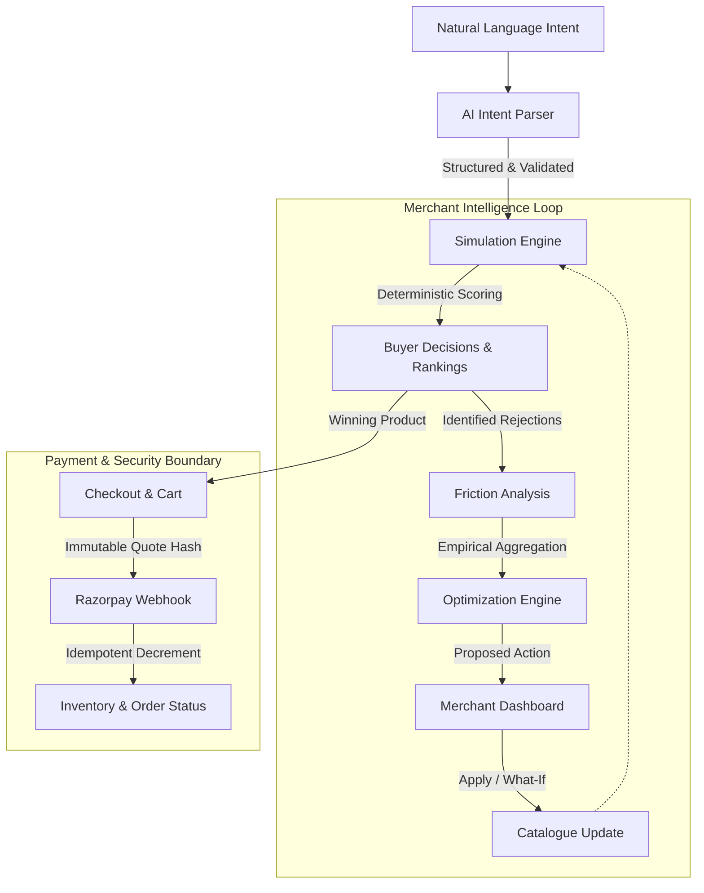
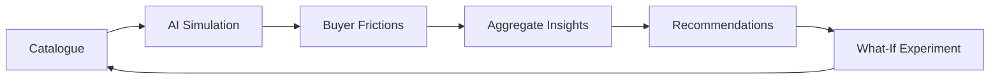

# Razorpay AI Commerce Intelligence

## AI Buyer Simulation + Merchant Optimization Platform

### 1. Executive Overview

The Razorpay AI Buildathon 2026 repository demonstrates a fully functional, end-to-end platform where **AI commerce directly intersects with merchant intelligence and deterministic financial boundaries**. 

Instead of building a simple AI chatbot wrapper over a storefront, we have built a closed-loop platform that allows merchants to simulate how autonomous AI buyers evaluate their catalogues, detect where friction prevents AI selection, and receive empirical, data-backed optimization recommendations to become "AI-commerce ready."

Critically, this platform is built on the principle of **bounded AI**. The system relies on Large Language Models for unstructured natural language interpretation, but explicitly hands control over to a deterministic simulation, scoring, and financial execution pipeline. AI proposes and interprets; deterministic systems decide and execute.

---

### 2. The Problem

AI commerce creates a new merchant problem. A merchant can optimize a storefront for humans using heatmaps, A/B tests, and analytics. However, autonomous buyers evaluate products fundamentally differently. They read structured metadata, enforce strict logical constraints, compute utility across multiple variables (price, speed, warranty), and refuse to buy if data is ambiguous.

Today, if an AI agent chooses a competitor's product over a merchant's product, the merchant has no visibility into *why*. Was it price? Delivery speed? Missing warranty metadata? A human UI cannot answer this. 

---

### 3. Our Product

Our platform gives the merchant a way to observe how synthetic AI buyers evaluate their catalogue. It identifies the exact friction preventing AI selection, diagnoses the root cause, recommends specific catalogue improvements, and allows merchants to test those improvements through What-If experiments before pushing them to production.

**The core product insight:** Human storefronts are designed for human browsing. Autonomous buyers need structured, unambiguous commerce information. Our platform bridges this gap, giving merchants a diagnostic intelligence loop.

---

### 4. Why This Matters for AI Commerce

This architecture provides the vital link between merchant operations and autonomous purchasing:
* **Discovery:** AI understands intent.
* **Decision:** Deterministic algorithms evaluate the catalogue.
* **Governance:** Strict budget and policy boundaries are enforced.
* **Transaction:** Secure financial execution via Razorpay.
* **Merchant Intelligence:** The merchant receives a feedback loop detailing exactly why their products failed to capture autonomous spend.

---

### 5. Product Architecture

---

### 6. AI Architecture

The system limits the LLM strictly to natural language understanding. It does not allow the LLM to invent prices, hallucinate inventory, or perform arithmetic for checkouts.

**Flow:**
1. **Natural-language buyer intent** (e.g., *"I need wireless headphones under ₹5,000 with fast delivery"*)
2. **Safety boundary** (Prompt sanitization against prompt injection)
3. **Intent Parser** (LLM extraction constrained to Pydantic)
4. **Structured/validated intent** (Category, Min/Max Budget, Requirements, Deadlines)
5. **Catalogue retrieval** (Deterministic DB query)
6. **Buyer persona & weights** (Deterministic application of utility weights)
7. **Deterministic constraints** (Budget and inventory filtering)
8. **Deterministic scoring & Ranking** 
9. **Selection/rejection & Friction diagnostics** 
10. **Merchant optimization insight**
11. **What-if experimentation**

---

### 7. Natural Language Intent Understanding

**Current Implementation:**
The API uses `IntentParser` (`app/ai/intent_parser.py`) to convert untrusted buyer prompts into a `StructuredIntent` Pydantic model (`app/schemas/buyer/intent.py`).

*   **Input:** Unstructured text.
*   **Validation:** Pydantic strictly validates fields such as `max_budget` (must be >= `min_budget`), `delivery_deadline_days` (0-365).
*   **Security:** Inputs pass through `PromptSafety.sanitize_input()` and are wrapped to prevent injection attacks before reaching the LLM. 
*   **Fallback:** If the LLM output fails schema validation, the system falls back safely rather than allowing malformed constraints to reach the commerce engine.

---

### 8. Synthetic Buyer Personas

The system features deterministic buyer personas rather than deploying a new LLM instance per synthetic buyer (which would be slow and non-reproducible). 

**Current Implementation:**
Personas (`BUDGET`, `SPEED`, `QUALITY`, `FEATURE`, `BALANCED`) are represented as deterministic utility weights (`app/api/v1/optimization/simulations.py`).
*   **SPEED Persona:** Weights delivery heavily (`0.55`) while deprioritizing price (`0.10`).
*   **BUDGET Persona:** Weights price heavily (`0.50`) and delivery low (`0.10`).

This ensures that running a simulation of "10 AI buyers" does not mean making 10 expensive, random LLM calls. It means evaluating the catalogue against a deterministically generated, mathematically rigorous matrix of buyer priorities, budgets, and constraints.

---

### 9. AI Buyer Simulation Engine

The Simulation Engine (`app/simulation/engine.py`) is the deterministic heart of the platform.

**Flow:**
1.  **Catalogue Input:** Receives active merchant catalogue.
2.  **Hard Constraints:** Filters products that outright fail the buyer's `StructuredIntent` (e.g., price exceeds `max_budget`, or product has zero inventory). 
3.  **Soft Friction:** Penalizes products for missing metadata or slow delivery.
4.  **Scoring & Ranking:** Calculates a weighted score using the persona's utility matrix. 
5.  **Output:** Returns a strictly ranked list of candidates, separating the "selected" product from the rejected ones, complete with decision traces.

---

### 10. Buyer Friction Intelligence

Friction is the core metric of the platform. Instead of simply telling a merchant "your product wasn't chosen," the system diagnoses exactly *why*.

**Current Implementation:**
`FrictionDetector` (`app/simulation/friction.py`) evaluates products for:
*   **HARD_CONSTRAINT / REJECTION:** (e.g., `BUDGET_EXCEEDED`, `OUT_OF_STOCK`, `DELIVERY_TOO_LATE`). These block selection entirely.
*   **SOFT_FRICTION / PENALTY:** (e.g., `DELIVERY_UNKNOWN`, `NO_RETURNS_POLICY`). These degrade the utility score relative to competitors.

The engine attaches a specific `FrictionReason` to every rejected product, giving the merchant actionable intelligence.

---

### 11. Merchant Intelligence Loop

The merchant's dashboard visualizes this loop. They see simulation runs, view the drop-off funnel where their products lost to competitors, and review aggregated friction data.

---

### 12. Optimization Recommendations

**Current Implementation:**
The `RecommendationService` (`app/services/optimization/recommendation_service.py`) aggregates friction events empirically. It groups them by reason across the catalogue to produce a prioritized set of `OptimizationRecommendation` entities.

Crucially, **recommendations are grounded in observed simulation friction, rather than hallucinated LLM advice.** If 50 simulated buyers abandoned a product because it lacked warranty metadata, the engine generates an actionable recommendation targeting that exact product and field. Merchants can then definitively transition a recommendation to an `APPLIED` status, automatically mutating their database catalogue.

---

### 13. What-If Simulation

Merchants can test the impact of a recommendation before committing it to the database.

**Current Implementation:**
The What-If endpoint (`app/api/v1/optimization/what_if.py`) accepts a hypothetical modification (e.g., `delivery_days: 2`). It runs an in-memory simulation against the catalogue with the modification applied, comparing the new candidate rankings and friction scores against the baseline. 
The state changes are intentionally *not* persisted, allowing merchants to safely gauge the simulated impact of metadata optimization.

---

### 14. Agent-Readable / Structured Catalogue

Human storefronts rely on beautiful images and marketing copy. Autonomous buyers require structured schemas.
Our platform implements a Pydantic-validated Product schema that includes explicit metadata fields (`delivery_days`, `warranty`, `return_days`). The friction engine explicitly penalizes missing structured data, incentivizing merchants to build agent-readable storefronts.

---

### 15. Inventory

**Current Implementation:**
Inventory is strictly decoupled from the AI/LLM domain. Inventory levels are stored in a dedicated `Inventory` table, managed via `ProductService` and `WebhookService`. 
During simulation, `OUT_OF_STOCK` is an absolute hard constraint. If a product has `available_quantity=0`, it is forcefully removed from candidate rankings before scoring begins. 

---

### 16. Merchant Dashboard

The frontend (React + TypeScript) exposes the intelligence loop:
*   **Overview/Dashboard:** High-level metrics and recent simulations.
*   **Catalogue:** Product CRUD and metadata completeness checks.
*   **Simulation:** Interface to launch scenario batches and view detailed ranking/friction traces.
*   **Optimization:** Aggregated recommendations where merchants can view root causes and trigger What-If evaluations.

---

### 17. Backend Architecture

*   **FastAPI:** High-performance async API layer.
*   **Services Layer:** Distinct service classes (`SimulationService`, `RecommendationService`, `CheckoutService`, `WebhookService`) encapsulating business logic.
*   **Pydantic:** Type-safe boundaries.
*   **SQLAlchemy ORM:** Production-grade PostgreSQL schema mapping.

---

### 18. Database Architecture

Our PostgreSQL database isolates domains clearly:
*   `User`, `Merchant`, `Customer`, `Policy`: Identity and authorization.
*   `Product`, `Inventory`: Catalogue state.
*   `SimulationRun`, `SimulationScenario`, `ScenarioResult`: Persistent simulation audit trails.
*   `OptimizationRecommendation`: Tracking merchant optimization lifecycle.
*   `Cart`, `CartItem`, `Quote`, `Authorization`, `Order`: The strict financial pipeline.
*   `AuditEvent`: Immutable ledger for merchant actions (e.g., applying a recommendation).

---

### 19. Security & AI Governance

Security is actively implemented, not just planned:
*   **Authentication & Roles:** JWT-based auth. Public registration is hard-coded to `CUSTOMER`. Merchant and Admin accounts are isolated securely.
*   **Idempotency:** Operations like recommendation application and webhook processing are strictly idempotent.
*   **AI Boundary:** The LLM cannot mutate database state, authorize payments, or modify quotes. It outputs intent; the backend code performs actions.

---

### 20. Razorpay Integration

The platform successfully implements the transaction boundary using Razorpay Test Mode.

**Current Implementation:**
1. AI selects a product.
2. The deterministic engine builds a `Cart`.
3. `QuoteService` generates an immutable `Quote`, locking the `line_items_snapshot`.
4. `CheckoutService` creates a Razorpay Order.
5. `WebhookService` securely receives `payment.captured`.
6. **Verification:** The webhook payload signature is cryptographically verified via HMAC-SHA256 (`app/security/webhook_verification.py`).
7. **Execution:** The inventory decrement relies exclusively on the immutable `quote.line_items_snapshot`, entirely preventing race conditions or tampering in the live cart.

---

### 21. Explainability & Auditability

Autonomous commerce requires complete auditability.
Every simulation result persists the exact buyer intent, persona weights, candidate scores, and friction reasons. When a merchant applies an optimization recommendation, an `AuditEvent` is generated capturing the exact `before_state` and `after_state` of the product, providing a fully auditable chain of custody.

---

### 22. AI vs Deterministic Responsibility Table

This strict responsibility boundary is currently implemented in code:

| Responsibility | AI | Deterministic System |
|---|---|---|
| Understand natural language | ✓ | |
| Extract structured intent | ✓ | ✓ (Pydantic validation) |
| Retrieve catalogue | | ✓ |
| Enforce budget limits | | ✓ |
| Check database inventory | | ✓ |
| Calculate weighted score | | ✓ |
| Rank product candidates | | ✓ |
| Detect specific friction | | ✓ |
| Recommend merchant action | | ✓ (Empirical aggregation) |
| Calculate payment amount | NEVER | ✓ |
| Authorize payment | NEVER | ✓ |
| Verify webhook signature | NEVER | ✓ |

---

### 23. Why Determinism Is a Feature

We deliberately engineered the simulation, scoring, and recommendation layers as deterministic systems. 
AI buyers may be probabilistic in real life, but **merchant optimization requires reproducible experiments.**

If a merchant changes a product's price, they must be able to run a What-If simulation and trust that the change in candidate ranking is due to their price adjustment, not an LLM hallucination or temperature variance. By isolating the LLM exclusively to intent parsing, we guarantee repeatability, debugging, explainability, and merchant trust.

---

### 24. Testing & Verification

The platform is backed by a rigorous test suite.
**Current Implementation Status:**
*   **Automated Tests:** 131 tests covering unit, integration, and security scenarios.
*   **Pass Rate:** 100% (131 passed, 0 failures).
*   **Coverage includes:** Simulation logic, recommendation lifecycle, merchant isolation, cryptographic webhook verification, inventory decrement safety, and end-to-end checkout flows.

---

### 25. End-to-End Example

**1. Natural Language Input:**
*"I need wireless headphones under ₹5,000 with good battery life delivered quickly."*

**2. Intent Parser (LLM):**
Extracts `StructuredIntent`: `max_budget: 500000` (paise), `delivery_deadline_days: 3`, `requirements: ["wireless", "battery"]`.

**3. Candidate Filtering (Deterministic):**
Filters out `Headphones B` (price: 600000) and `Headphones C` (inventory: 0).

**4. Scoring & Friction (Deterministic):**
Evaluates `Headphones A` against the `SPEED` persona. Detects missing `delivery_days` metadata. Applies `DELIVERY_UNKNOWN` soft friction penalty. Score drops.

**5. Merchant Intelligence:**
Merchant dashboard highlights `DELIVERY_UNKNOWN` on `Headphones A`. 

**6. Optimization & What-If:**
Recommendation suggests setting `delivery_days`. Merchant runs What-If with `delivery_days: 2`. Simulation re-runs, friction vanishes, rank improves. Merchant clicks "Apply", permanently updating the PostgreSQL catalogue.

---

### 26. Current Implementation Status

#### Built and Working
* LLM Intent Parsing with Pydantic validation and prompt safety.
* Deterministic Simulation Engine & Scoring.
* Friction detection (Hard/Soft constraints).
* Recommendation generation from empirical simulation data.
* What-If in-memory evaluation.
* Idempotent catalogue mutations.
* Immutable Quotes & HMAC-secured Razorpay Webhook processing.
* 131-test integration suite enforcing role security and isolation.

#### Built but Still Maturing
* The scenario variant generation currently uses fixed matrices to cover edge cases predictably, rather than generating infinite dynamic permutations.

#### Future Direction
* Agent-to-Agent (A2A) protocol API endpoints.
* Integration with dynamic LLM-driven pricing bots.

---

### 27. Why This Is Relevant to Razorpay

We designed an AI-commerce control loop where probabilistic intelligence is bounded by deterministic commerce and financial infrastructure. 

For Razorpay, this architecture ensures that the rise of autonomous AI buyers does not compromise payment integrity or merchant control. We did not simply put a chatbot in front of a checkout. We built a platform that allows merchants to safely analyze, optimize, and capture autonomous spend, while ensuring that all financial execution remains strictly within auditable, deterministic boundaries.

---

### 28. Closing Summary

The Razorpay AI Buildathon 2026 repository represents a production-minded approach to Agentic Commerce. By separating semantic understanding from financial execution, and by providing a closed-loop intelligence dashboard, we have built a platform that prepares merchants for the autonomous future without sacrificing the security, auditability, and determinism required by modern fintech.
